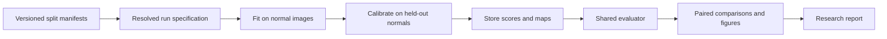

# MVTec Visual Inspector: Project Review and Research Development Plan

**Review dates:** 23–24 September 2026  
**Audience:** Junior ML Engineer, AI Engineer, and Data Scientist candidates  
**Scope:** Experimental design, model development, technical improvements, evaluation, and reproducible research. Backend, frontend, API deployment, and product development are deferred, as requested.  
**Reviewed snapshot:** `6b3c0dbba97ec5eb44fd8a0ede8b295009b78b29`, including the pre-existing uncommitted working-tree changes. Findings describe that snapshot, not a clean release.  
**Evidence labels:** *Verified* = inspected code or locally reproduced behavior; *Recorded* = existing repository results, not independently retrained; *Proposed* = future work; *Literature* = externally sourced evidence.

This document is a proposed revision to the existing research plan. It does not silently replace the frozen protocol or claim that the proposed experiments have run. Adopt protocol changes through the project's decision log and version affected results.

**Reading guide:** Start with [assessment](#1-assessment-and-recommended-direction), then [verified findings](#3-review-findings-that-should-change-the-experiment-plan). For execution, use the [evaluation protocol](#5-evaluation-protocol-for-the-next-research-version), [experiment program](#7-concrete-experiment-program), and [schedule](#10-resource-plan-and-schedule). For applications, use the [junior readiness criteria](#11-what-the-project-should-achieve-for-junior-applications) and [portfolio artifacts](#12-portfolio-artifacts-and-communication). The [first ten work items](#13-first-ten-work-items) provide a compact implementation backlog.

## 1. Assessment and recommended direction

The project already has a useful research foundation: explicit normal-only training, substantive trivial baselines, split audits, custom metrics, generated notebooks, a common model interface, and real VisA measurements. These are good signals of scientific judgment and Python engineering.

Its present weakness is the gap between the rigor described in the documentation and the rigor enforced along every execution path. The current evidence supports an **experimental research prototype**. A reader cannot yet reproduce the headline PatchCore results from a complete configuration and immutable code version, and several implementation issues can invalidate planned comparisons.

The strongest next version should answer this question:

> **How can normal-only visual anomaly detection find small defects reliably at low false-alarm rates, under limited memory and changing image conditions?**

That question connects the current findings to three substantial contributions:

1. **Trustworthy measurement:** reference agreement, correct operating-point calibration, uncertainty, and reproducible experiments.
2. **A technical improvement:** bounded-memory high-resolution feature extraction and retrieval, assessed against small-defect performance.
3. **An explanatory study:** separate the effects of representation, map-to-image aggregation, calibration, and distribution shift.

For junior applications, the objective should be a compact body of evidence that you can explain and reproduce: a valid baseline, a justified change, an ablation showing why it helped or failed, and an honest account of generalization. A new state-of-the-art algorithm is optional. A web application is outside this phase.

The hiring guidance below is my assessment of what this project can demonstrate, not a universal employer scorecard or a guarantee of employment. The emphasis on reliable pipelines, objectives, and simple baselines is consistent with Google's [Rules of Machine Learning](https://developers.google.com/machine-learning/guides/rules-of-ml).

### Immediate priorities

| Order | Work | Why it comes first |
|---|---|---|
| 1 | Correct thresholds, PatchCore scoring, experiment identities, and the AE training path | Otherwise larger sweeps can produce misleading or unusable results |
| 2 | Reproduce a pinned reference implementation and regenerate auditable baselines | Establish what the existing model actually implements |
| 3 | Run aggregation/calibration and memory/resolution studies | These directly address the observed failure modes |
| 4 | Add a small set of distinct model families | Establish whether improvements are specific to one method |
| 5 | Confirm on previously unused categories or a second dataset | Separate exploratory gains from generalization |
| 6 | Publish a research report, figures, case book, and reproducibility bundle | Make the evidence easy to inspect in a hiring process |

## 2. What exists today

### Verified implementation and execution

| Area | Evidence | Assessment |
|---|---|---|
| Data protocols | Dataset indices, normal-only fit guard, split carving, hash-based integrity checks | Useful foundation; do not confuse split separation with freedom from model-selection leakage |
| Baselines | Random, intensity, histogram, and pixel PCA | Valuable controls, especially for `pcb1` |
| Deep models | Custom PatchCore and convolutional AE implementations | Present; correctness and integration gaps remain |
| Evaluation | Image metrics, pixel AUROC, AU-PRO, thresholded segmentation | Substantive work; external agreement is still required |
| Experiment tools | YAML composition, hashing, tracking wrapper, generated notebooks | Components exist, but notebooks and CLI do not consistently use them |
| Local tests | `python -m pytest -q`: **243 passed in 25.36 seconds** on Python 3.11.9 | Confirms the current suite; it does not establish deep-model correctness |
| Lint | `python -m ruff check src tests`: **passed** | Verified locally |
| Type checking | `python -m mypy src/inspector` | Could not run: Windows Application Control blocked a mypy DLL import |
| Result provenance | 45 VisA CSV rows, all `dirty=True`; all 9 PatchCore rows have blank `config_hash` and `git_sha` | Current PatchCore rows cannot be promoted under the repository's own clean-run policy |
| Product components | API and app packages are placeholders | Deferred by the revised scope; no implementation work is needed here now |

The review ran small synthetic diagnostics, not a new real-data training campaign. Existing user changes were preserved.

### Recorded results worth investigating

The following means were recalculated from [results_visa.csv](../reports/results_visa.csv). They summarize the existing three seeds; they are not new benchmark runs.

| Category | Image AUROC | AU-PRO@0.05 | SegF1 at 3-sigma | Realized image FPR | Image recall at stored operating point |
|---|---:|---:|---:|---:|---:|
| `pcb1` | 0.9373 | 0.7317 | 0.2173 | 6.67% | 59.33% |
| `macaroni2` | 0.7166 | 0.6784 | 0.0433 | 3.00% | 11.33% |
| `capsules` | 0.6967 | 0.4299 | 0.5268 | 0.00% | 17.33% |

Three promising research observations follow, subject to the implementation issues in Section 3:

- **Ranking and decisions disagree.** Good threshold-free localization does not ensure useful image decisions or pixel masks at the chosen threshold.
- **Small defects are a plausible bottleneck.** The existing EDA estimates that 43.9% of `macaroni2` defect regions have a thin dimension below one input pixel at long side 320. This motivates resolution experiments; it does not prove those defects leave no visual signal after resizing.
- **Simple models expose shortcuts and missing controls.** The recorded `pcb1` histogram AUROC is approximately 0.831. Pixel PCA exceeds the current PatchCore image AUROC on `macaroni2` and `capsules`. These are reasons to investigate aggregation, nuisance variation, and implementation fidelity.

Use the wording “our current implementation exhibits this behavior.” Do not infer that PatchCore generally fails at detection, that lighting is definitively the causal shortcut, or that the benefit over PCA isolates the effect of pretraining. Those conclusions require additional controls.

## 3. Review findings that should change the experiment plan

Priorities here are research priorities: **P0** blocks credible interpretation or execution of a planned main experiment; **P1** should be resolved before expansion; **P2** improves reporting and maintenance. These are findings and repair recommendations, not fixes made by this review.

### F01 — P0: The false-positive target is not an upper bound

**Verified.** In [thresholds.py](../src/inspector/postproc/thresholds.py), line 121, the code selects the `ceil(alpha * (n + 1))`-th largest calibration score. Under continuous exchangeable scores, its marginal exceedance probability is `k / (n + 1)`, which can exceed `alpha`.

Local diagnostics for the current validation sizes returned:

| Validation normals | Requested target | Current recorded expected rate |
|---:|---:|---:|
| 136 (`pcb1`) | 1.00% | 2/137 = **1.460%** |
| 135 (`macaroni2`) | 1.00% | 2/136 = **1.471%** |
| 81 (`capsules`) | 1.00% | Silently raised to 1/82 = **1.220%** by the percentile wrapper |

The wrapper defaults to `strict=False`; the pipeline does not export these target adjustments into dedicated CSV columns. In addition, `Threshold.apply` uses `>=`: with identical calibration and future scores, the diagnostic flagged **100%** of normal samples. The continuous-score argument does not cover that tie behavior.

**Repair:** define whether the target is a conservative bound or an approximate operating level. For conservative split-conformal calibration, use ascending rank `ceil((n + 1) * (1 - alpha))` with a strict exceedance decision and an explicit policy when the rank exceeds `n`. With insufficient data, reject the request or represent an always-accept threshold explicitly. Preserve both requested and effective targets; test ties, finite-sample boundaries, and non-finite inputs. See [Angelopoulos and Bates](https://arxiv.org/abs/2107.07511).

`1/(n+1)` is the resolution of a nontrivial finite order-statistic procedure, not a universal impossibility theorem for every estimator. Marginal calibration is also not a guarantee that one fixed fitted model has conditional FPR below the target. Lighting shift can violate the exchangeability assumption.

### F02 — P0: The planned PatchCore k ablation does not change scoring

**Verified.** [patchcore.py](../src/inspector/models/patchcore.py), lines 209–210, computes `topk` but always uses `knn[:, 0]`. Image scoring also uses the nearest entry and a separate hard-coded neighborhood of nine. A small tensor diagnostic produced identical patch and image scores for `k=1,2,3`.

**Impact:** the planned `k={1,3,9}` sweep does not test the stated hypothesis; it mainly changes computation and output metadata.

**Repair:** separate `patch_neighbors`, `patch_reduction` (nearest, mean, kth), and `image_reweight_neighbors`. Add a behavioral test with deliberately unequal distances. Remove a sweep axis if it is intentionally inactive.

### F03 — P0: Image-score reweighting differs from the reference mechanism

**Verified by code comparison.** [patchcore.py](../src/inspector/models/patchcore.py), lines 218–244, computes weights from distances between a memory entry and its bank neighbors. The query descriptor is passed to `_image_score` but is unused. The [anomalib reference implementation](https://raw.githubusercontent.com/open-edge-platform/anomalib/main/src/anomalib/models/image/patchcore/torch_model.py) selects neighbors around the nearest memory entry and computes the weight using distances from the anomalous query patch to those support entries.

**Impact:** the current image-detection results cannot yet diagnose the behavior of the reference scoring rule. Feature pooling/projection and smoothing order also need a documented comparison with the selected reference.

**Repair:** compare raw maximum, the current rule, and the corrected reference rule on the same descriptors and memory bank. Check exact toy examples before rerunning real data. Distinguish agreement with the paper, the [author repository](https://github.com/amazon-science/patchcore-inspection), and anomalib; their implementation choices need not all coincide.

### F04 — P0: Results and resume keys do not fully identify an experiment

**Verified.** The notebook `execute` helper in [build_notebooks.py](../scripts/build_notebooks.py), around line 645, appends pipeline results without attaching resolved configuration or git provenance. Default empty hashes reach the VisA CSV. Human-readable checkpoint keys omit some effective parameters, so changing a default can incorrectly reuse a completed run. A skipped run returns `None`, so resumed-session summaries omit previously completed results.

The CLI has another issue: it hashes the original `cfg`, while `--methods`, `--categories`, and `--seeds` can change the actual run without being written back into that configuration.

**Repair:** create one experiment runner shared by CLI and notebooks. Build a fully resolved specification for each run, including model defaults, seed, transforms, metrics, calibration, and data manifests. Hash it together with implementation/version identifiers. Resume by immutable run ID, reload completed results, and aggregate from the registry. Add tests that changing a meaningful parameter changes the run ID and that restarting preserves a complete table.

Keep the old CSV as exploratory historical evidence. Rerun with new metadata; do not fill missing hashes retrospectively as if their provenance were known.

### F05 — P0: The documented PatchCore CLI command fails

**Verified.** [cli.py](../src/inspector/cli.py), line 215, accepts only `TIER0_MODELS`, despite `build_model` supporting PatchCore and CAE. Running the documented pattern with `--methods patchcore` returns exit code 2 and “unknown method(s).” `fit`, `predict`, `evaluate`, and `bench` are still placeholders.

**Repair:** route `run` through the shared model factory and resolved runner. Implement only the research commands needed now: fit/evaluate a configuration, reevaluate stored predictions, and summarize results. Validate documented commands on a small fixture. Do not expand API or UI scope to solve this problem.

### F06 — P0 for AE experiments: Aspect-preserving inputs can break training

**Verified.** A depth-4 AE given `(2,3,171,256)` produces `(2,3,160,256)`. That input shape is representative of a 1500×1000 image resized to long side 256. In [autoencoder.py](../src/inspector/models/autoencoder.py), lines 212 and 220, training and validation loss compare network output directly with the original tensor. Only inference currently corrects mismatched dimensions.

**Repair:** use a consistent pad/unpad or resize policy in training, validation, and inference, with explicit valid-pixel masking if needed. Test odd and non-square dimensions with a forward/backward step. Also make the SSIM data range match the input normalization, and record that combined L2+SSIM training currently uses SSIM-only scoring. Treat that scoring choice as a separate ablation.

### F07 — P1: Memory is bounded in some components but not end to end

**Verified by inspection.** Four allocations deserve separate measurements:

- [features.py](../src/inspector/models/features.py), line 178, concatenates all extracted patch chunks before subsampling, temporarily retaining both chunks and the combined array.
- [patchcore.py](../src/inspector/models/patchcore.py), line 60, transfers the entire coreset candidate matrix to the GPU in float32; tiling the distance calculation does not remove that allocation.
- Its inference path builds the complete query-patch × bank distance matrix and transfers/converts the bank for each image.
- [pipeline.py](../src/inspector/pipeline.py), lines 241–253, materializes all maps and masks; [aupro.py](../src/inspector/metrics/aupro.py), line 153, concatenates all negative pixels before sampling them.

The recorded native-resolution host-memory concern is credible, but extracting one native image successfully does not establish that fitting, retrieval, and evaluation will fit.

**Repair:** stream patch selection during extraction; bound candidate and final bank sizes separately; chunk exact nearest-neighbor search; keep a resident bank where practical; use replayable map iterators and streaming negative sampling. Measure process RSS and GPU allocated/reserved peaks separately for extraction, selection, inference, and evaluation.

### F08 — P1: Some coreset settings collapse to the same effective bank

**Verified by inspection.** For large datasets, candidates are capped at 10% by default. Requested bank size is then capped to candidate count. Thus the planned 10% and 25% coreset settings both retain the whole 10% candidate pool, given the same seed and other settings.

**Repair:** log total patches, candidate count, requested bank size, and effective bank size. Prefer explicit candidate/bank budgets for the main study. Verify that every sweep value changes the intended resource or behavior.

### F09 — P1: Robustness and clean AU-PRO use different negative populations

**Verified by inspection.** The generated notebook's `robustness_row`, around line 893 in [build_notebooks.py](../scripts/build_notebooks.py), collects maps only for anomalous images. The main pipeline includes normal-image maps. Both results are named `aupro_005`, although their FPR denominators differ.

**Repair:** use the same evaluator and include normal images with zero masks. Assert that severity-zero corruption reproduces clean metrics within numerical tolerance. Define corruption seeds per image and transformation; reusing seed 0 independently for every image can induce a shared noise pattern.

### F10 — P1: The statistical comparison label is incorrect

**Verified.** [stats.py](../src/inspector/stats.py), line 156, multiplies one p-value by `family_size`. That is Bonferroni correction, although the result is labeled Holm–Bonferroni. A separate correct step-down helper already exists. The same module rejects Wilcoxon samples smaller than six, so three category aggregates cannot pass the documented comparison workflow.

**Repair:** either label the scalar adjustment Bonferroni, or collect the full prespecified family and use the Holm helper. Compare performance metrics, not raw anomaly-score magnitudes. Use paired image-level or group-level resampling for the actual estimand, as described in Section 5.

### F11 — P1: Local passing tests do not demonstrate a clean installation

**Verified configuration mismatch; fresh-environment failure was not run.** CI installs `[dev]`, while transformations and corruption tests require OpenCV, currently listed under `[torch]`. The minimum NumPy dependency is 1.26, while metrics call `np.trapezoid`, which was [introduced in NumPy 2.0](https://numpy.org/doc/stable/reference/generated/numpy.trapezoid.html).

**Repair:** align dependency groups with actual imports, make supported version bounds truthful, and save a tested environment lock/constraints file. Run a minimal CPU installation job plus a small optional torch job with no weight downloads. The existing suite lacks behavioral coverage of the deep-model paths exposed above.

### F12 — P2: Some conclusions are stronger than the evidence

Revise the narrative in the next report:

| Current interpretation to reconsider | More defensible interpretation |
|---|---|
| “The pretrained prior bought this gain” from PCA vs PatchCore | Architecture, features, scale, scoring, and pretraining changed together; a matched control is required |
| A random-control result validates the metric implementation | It is a useful sanity check; independent reference agreement and adversarial cases are still needed |
| Every difference below a seed standard deviation is noise | Paired differences and their uncertainty determine detectability; one model's standard deviation is not a decision threshold |
| A region thinner than one resized pixel has disappeared | It risks attenuation/aliasing; area interpolation may retain a weak signal |
| High pooled pixel AUROC proves precise localization | Pooled ranking, image-level separability, defect area, and within-image localization must be separated |
| AUPRO/SegF1 ratios measure calibration quality | They compare different objectives and scales; inspect score tails, curves, and fixed-threshold errors directly |
| Classic MVTec is “finished,” or an old table is current SOTA | Scope the claim to the benchmark, metric, split, and source date; avoid unverified leaderboard claims |

Also distinguish measured end-to-end average time from model-only p50/p95 latency. The current pipeline timing includes reading images and writing prediction maps; it is not a latency distribution.

## 4. Expand the research problem in controlled steps

Use the existing three categories for development. Organize extensions around explicit research questions, rather than treating every available architecture as another mandatory experiment.

| Research question | Working hypothesis, not a conclusion | Main evidence |
|---|---|---|
| **RQ1: What causes the detection/localization gap?** | Correct query-based reweighting or robust aggregation may improve image ranking and recall without changing the anomaly map | Same-map aggregation experiment, fixed operating point, error transitions |
| **RQ2: What limits small-defect detection?** | Input resolution, feature-grid stride, and smoothing may matter more than a larger backbone | Size-stratified results, resolution/stride controls, memory measurements |
| **RQ3: How stable is calibration?** | Small normal calibration sets and distribution shift may dominate operating-point variability | Calibration-size curves, empirical FPR intervals, frozen-threshold corruption tests |
| **RQ4: Which normality model is most useful under a resource budget?** | Retrieval, Gaussian modeling, reconstruction, and distillation may occupy different accuracy/memory/time tradeoffs | Matched evaluation across representative families |
| **RQ5: How much normal data is needed?** | More images and more patches per image may provide different kinds of coverage | Nested normal-data subsets, fixed calibration data, fixed bank budgets |
| **RQ6: When does the one-class setup stop being adequate?** | Logical defects, contaminated training, or a small labeled budget may change the best method | Separately labeled experimental tracks, after the core study |

Recommended project subtitle: **“Reliable Visual Anomaly Detection under Limited Data and Memory.”** Keep MVTec/VisA visible as datasets, while making the contribution broader than running a benchmark model.

## 5. Evaluation protocol for the next research version

### 5.1 Separate development, calibration, and confirmation

The existing three categories have already influenced EDA, resolution choices, hypotheses, and reports. Their test results are now **development evidence**. This cannot be undone by renaming a split or freezing a configuration today.

Use these roles explicitly:

| Partition or track | Permitted use | Prohibited use |
|---|---|---|
| Fit normals | Fit weights, feature statistics, whitening, and memory bank | Include calibration or final test images |
| Inner fit holdout | AE early stopping or other normal-data training decisions | Treat it as an independent final evaluation |
| Development benchmark | Compare configurations, inspect failures, formulate hypotheses | Claim its repeatedly selected best result is untouched test performance |
| Calibration normals | Set final operating thresholds after model selection | Select the best anomaly AUROC or reuse these images in the bank |
| Confirmation categories/dataset | Evaluate a frozen recipe once; fit only on that target category's allowed training normals | Retune the recipe after seeing the confirmation result and retain the same “held-out” claim |

For normal-only model selection, use predeclared defaults, normal-data objectives, synthetic proxy anomalies, or transfer a recipe selected on disjoint development categories. None is automatically a good proxy for real defect recall. If actual anomalous development labels select a configuration, state that supervision explicitly even though model fitting remains normal-only.

Keep an independent calibration subset after any normal-data hyperparameter selection. Record all split IDs. Where images share a part, scene, production lot, or capture session, split and resample at that group level. If the dataset lacks those identifiers, state that image independence cannot be fully checked.

### 5.2 Dataset expansion

| Dataset / use | Priority | Experiment role and limits |
|---|---|---|
| VisA: `pcb1`, `macaroni2`, `capsules` | Core | Development, diagnosis, all main ablations |
| Previously unused VisA categories | Core confirmation | Freeze category list before inspection; apply the same recipe and fit each category's own normal data |
| All 12 VisA categories | Strong portfolio target | Report coverage, macro mean, worst category, and development vs confirmation status separately |
| Classic MVTec AD | Reference/transfer option | Reproduce a pinned method under matched settings; use its own training normals for a separate transfer experiment |
| MVTec AD 2 | High-value extension | Small defects and real lighting variation; account for public vs private evaluation and registration requirements |
| MVTec LOCO AD | Later extension | Study missing/wrongly positioned normal objects and logical constraints with its official evaluation conventions |
| Small self-captured collection | Optional | Demonstrate capture-session shift; explicitly label artificial defects and limited sample size |

VisA's official repository provides its one-class split and data information. MVTec AD 2 provides defect-free training/validation, high-resolution scenarios, and private ground truth evaluated through its server. LOCO contains both structural and logical anomalies. These are different experimental roles, not interchangeable leaderboard tables. Sources: [VisA](https://github.com/amazon-science/spot-diff), [MVTec AD 2](https://www.mvtec.com/research-teaching/datasets/mvtec-ad-2), [MVTec LOCO AD](https://www.mvtec.com/research-teaching/datasets/mvtec-loco-ad).

A recipe transferred to another dataset and refitted on its normal training images tests **recipe transfer**. It is not zero-shot transfer of the fitted detector. Record the distinction.

### 5.3 Metrics that answer different questions

| Question | Required metric/output | Interpretation guard |
|---|---|---|
| Does the model rank defective images above normal ones? | Image AUROC and image average precision (AP) | AP depends on test prevalence; record class counts and the exact AP convention |
| What happens at a usable threshold? | Recall, escape rate, realized FPR, TP/FP/TN/FN, threshold source | Report the calibration target and effective rank separately from observed test FPR |
| Does it localize small regions? | AU-PRO@0.05, AU-PRO@0.30, region-size breakdown | Record connectivity, negative population, threshold grid, and sampling seed |
| Is localization useful on individual anomalous images? | AUPIMO distribution, median, lower tail, per-image IDs | Specify FPR integration bounds and ensure enough normal evidence in that range |
| Are thresholded masks useful? | Dice/F1, IoU, precision, recall at frozen pixel thresholds | Keep pooled and per-image summaries distinct; handle normal-only images explicitly |
| Does performance survive realistic change? | Absolute recall/FPR changes and localization degradation | Freeze model and thresholds; include both normal and anomalous images |
| What does it cost? | Fit time, inference p50/p95, peak RSS/VRAM, bank/artifact size | Name hardware, batch size, precision, warm-up, synchronization, and measurement scope |

[AUPIMO](https://arxiv.org/abs/2401.01984) supplies per-image overlap measures with a normal-image-based false-positive axis. It is a useful addition, not a substitute for image-level recall or operating-point calibration. Start from the author/reference implementation and verify agreement before writing a custom version.

For approximate metrics, validate convergence: for example, compare 256/512/2048 AU-PRO thresholds and increasing negative-sample budgets on a fixed pilot. Set numerical tolerances before model selection. An approximate evaluator's error should be materially smaller than the improvement being claimed.

### 5.4 Uncertainty and statistical comparisons

1. **Report two different uncertainties.** Three seeds describe stochastic fitting/subsampling variability. Image/group bootstrap intervals describe finite evaluation-sample uncertainty. Repeating the same test images with three seeds does not triple the sample size.
2. **Use paired comparisons.** Evaluate both methods on the same images, splits, corruption realizations, and subset draws. For AUROC differences, stratify a paired bootstrap by class. For localization, resample images or physical groups and recompute the aggregate metric; do not treat correlated pixels as independent observations.
3. **Handle AUPIMO's shared normal reference.** Its per-anomaly values depend on a common normal-image curve. For primary intervals, resample the normal and anomalous image groups and recompute that curve; a naive independent per-image test can understate uncertainty. Operating decision thresholds remain frozen unless the experiment explicitly studies calibration uncertainty.
4. **Do not test raw score differences as performance differences.** Two anomaly scores can have arbitrary scales. Compare per-image errors, valid per-image metrics, or a paired difference in the aggregate evaluation statistic.
5. **Predefine the family of confirmatory hypotheses.** Apply Holm across that full family. Exploratory sweeps should be labeled exploratory; correction alone does not repair repeated test-based selection.
6. **Report effects before p-values.** Include absolute differences, confidence intervals, category regressions, and the practical cost. With few categories, do not imply broad industrial generality.

For false alarms and recall, give binomial intervals conditional on each fitted model/threshold and the sampled evaluation images. With **0 false positives among 60 normals**, the one-sided exact 95% upper bound is approximately **4.87%**, not 0%. With 100 normals it is approximately 2.95%. Roughly 299 independent normals with zero false positives are needed to place that bound below 1%. These are sample-size illustrations, not a claim that the dataset guarantees independent factory events.

Keep separate the roughly 99 calibration normals needed for a nontrivial 1% rank-based marginal rule and the larger evaluation sample needed to substantiate low observed FPR. Millions of pixels do not provide millions of independent normal images.

### 5.5 Translate metrics into consequences without inventing factory impact

Use a transparent simulation with assumed defect prevalence `pi`:

```text
missed defects per 10,000 = 10,000 * pi * (1 - recall)
false alarms per 10,000  = 10,000 * (1 - pi) * FPR
alarm precision         = pi * recall / (pi * recall + (1 - pi) * FPR)
```

For an illustrative prevalence of 0.3%, recall 80%, and FPR 1%, these formulas give 6 missed defects, about 100 false alarms, and about 19% alarm precision per 10,000 inspected items. This is a scenario, not a measured result of this project. Show several prevalence and error-cost assumptions rather than claiming unmeasured savings.

## 6. Model and method portfolio

The first release should contain a few representative families plus focused ablations. The remaining methods form a research backlog; they are not all prerequisites for junior applications. Budget classes below are relative planning estimates, not measured GPU hours.

| Method | Scientific purpose | Implementation strategy | Priority / expected cost |
|---|---|---|---|
| Random, intensity, histogram, pixel PCA | Chance controls, global shortcuts, linear reconstruction | Retain own implementations | Core / very low |
| Global frozen features + shrinkage Mahalanobis; optional kNN or OC-SVM | Is an image embedding sufficient, without dense retrieval? | Own small baseline; standard estimator for covariance/SVM | Core / low |
| CAE-L2 and CAE-SSIM | What can target-normal reconstruction learn without a pretrained feature backbone? | Repair existing code; two losses before a large architecture sweep | Core / medium |
| Corrected PatchCore + pinned reference | Retrieval baseline and platform for improvements | Own implementation plus independently run reference | Core / medium; RAM-sensitive |
| PaDiM | Per-position Gaussian modeling vs an unordered memory bank | Library/reference comparator first | Core candidate / low-medium; covariance memory matters |
| EfficientAD-S | Student-teacher/local-global modeling with a different inference cost profile | Pinned implementation; record pretrained teacher and auxiliary training data | Core candidate / medium |
| RD++ | Reverse distillation; compare feature reconstruction with retrieval | Author implementation or explicitly equivalent adapter | Expansion / medium |
| SimpleNet | Target feature adaptation and synthetic anomalies in feature space | Reference first; ablate noise and adaptation separately | Expansion / medium |
| DRAEM or CutPaste-style synthetic training | Does image-space synthesis address the current misses? | Choose one; document texture sources and mask-generation rules | Expansion / medium-high |
| FastFlow | Learn a density in feature space instead of nearest-neighbor geometry | Pinned implementation | Optional / medium-high |
| Frozen DINOv2 or DINOv3 features + kNN | Does a different pretrained representation improve the same scoring mechanism? | Add a token-grid adapter; keep detector and bank budget controlled | High-value expansion / medium; pilot memory |
| Dinomaly | Transformer feature reconstruction and unified multi-category modeling | Reference implementation; report single-category and unified settings separately | Stretch / high |
| WinCLIP / WinCLIP+ | Zero-target-normal and few-normal-shot cold-start comparison | Reference; freeze prompts and support selection | Stretch / medium |
| AnomalyCLIP | Auxiliary-data-trained prompt learning for target zero-shot transfer | Audit source datasets, labels, weights, and overlap | Stretch / medium-high |

The family descriptions are supported by the original sources: [PaDiM](https://arxiv.org/abs/2011.08785), [EfficientAD](https://arxiv.org/abs/2303.14535), [RD++](https://openaccess.thecvf.com/content/CVPR2023/html/Tien_Revisiting_Reverse_Distillation_for_Anomaly_Detection_CVPR_2023_paper.html), [SimpleNet](https://openaccess.thecvf.com/content/CVPR2023/html/Liu_SimpleNet_A_Simple_Network_for_Image_Anomaly_Detection_and_Localization_CVPR_2023_paper.html), [DRAEM](https://openaccess.thecvf.com/content/ICCV2021/html/Zavrtanik_DRAEM_-_A_Discriminatively_Trained_Reconstruction_Embedding_for_Surface_Anomaly_ICCV_2021_paper.html), [FastFlow](https://arxiv.org/abs/2111.07677), [DINOv2](https://arxiv.org/abs/2304.07193), [DINOv3](https://github.com/facebookresearch/dinov3), [Dinomaly](https://arxiv.org/abs/2405.14325), [WinCLIP](https://arxiv.org/abs/2303.14814), and [AnomalyCLIP](https://arxiv.org/abs/2310.18961).

**Recommended starting subset:** existing floors, two AE losses, corrected/reference PatchCore, global Mahalanobis, and one of PaDiM or EfficientAD. Add the other comparator or a small DINO backbone after the first main study is complete.

Do not label an auxiliary-defect-trained model as using no anomaly labels anywhere. Distinguish target-normal-only fitting, external supervised pretraining, auxiliary anomaly supervision, target few-label learning, and transductive use of test batches. Also avoid using “no training” to mean “no data-dependent fitting”: PatchCore still fits its bank to training data.

Current research does not make every extension novel. For example, the May 2026 preprint [Mahalanobis PatchCore](https://arxiv.org/abs/2605.27748) explicitly studies covariance-aware retrieval and bounded-memory construction. This is relevant related work for the proposed memory/whitening study; its reported gains are not verified results on this repository. Frame your contribution as a controlled implementation and evaluation under your constraints unless a broader novelty review supports a stronger claim.

## 7. Concrete experiment program

Every experiment should record: hypothesis, mechanism, control, dataset roles, seeds, resource cap, primary metric, secondary diagnostics, selection rule, and a stopping condition. The following is an ordered program; optional branches should not delay completion of the core evidence.

### E00 — Establish a trustworthy reference

**Hypothesis:** part of the current detection deficit is implementation-dependent.

Compare the present implementation, corrected own implementation, and a pinned reference on identical small tensors, then the same development data. Match weights, input geometry, layers, descriptors, bank selection where possible, distance units, map smoothing, and score aggregation. Keep a difference ledger where exact matching is impossible.

**Deliverable:** a reproduction report with prediction-level differences, metric tolerances, run manifests, and runtime. A full published aggregate number requires the same categories and protocol; three categories cannot reproduce a 15-category mean. Gate all subsequent PatchCore conclusions on this result.

### E01 — Build the baseline ladder

Compare the starting subset in Section 6 under the same evaluation protocol. Use three fitting seeds for stochastic methods; do not rerun deterministic baselines merely to create an artificial standard deviation. Separate AE early-stopping normals from final calibration normals.

**Primary output:** a per-category table with ranking, fixed-threshold recall/FPR, localization, and resources. Report both a controlled common-resolution comparison and, later, a clearly labeled per-method resource-constrained setting. Avoid interpreting architecture differences as pretraining effects.

### E02 — Separate image aggregation from map quality

**Hypothesis:** a single extreme patch is unstable, while averaging the whole image dilutes tiny defects.

Hold descriptors and maps fixed. Compare raw maximum, corrected PatchCore weighting, mean of the top 0.1%/1%/5% of map pixels, and a connected-component score. For component scoring, choose the map threshold and area policy from development/calibration information, not each test mask. Define the aggregation domain and minimum pixel count explicitly.

**Measurements:** image AUROC/AP, recall at frozen calibration targets, per-defect misses, and false alarms on normal variation. Localization metrics should remain unchanged when the map is unchanged; that is an informative control. Select at most two candidates on development data and confirm with paired comparisons.

**Why this is high priority:** it directly targets the current gap and can often reuse cached predictions without refitting the backbone.

### E03 — Study calibration and sample-size limits

Compare corrected conservative rank calibration, the documented sigma heuristic, and an optional robust median/MAD heuristic. Use target image FPR levels of 1%, 2%, and 5% only where the selected procedure and sample size support them. For pixel decisions, distinguish a pixel-tail heuristic from an image-level false-alarm guarantee.

Draw repeated calibration subsets such as 20/40/80/120 normals where available, using only the reserved normal calibration pool. Keep the model fixed and report the distribution of thresholds, FPR, and recall. Smaller categories need smaller maximum subsets; do not augment the pool with test normals.

**Control that prevents wasted experiments:** a positive affine score transform with a consistently transformed threshold leaves decisions unchanged. It also leaves a mean-plus-three-standard-deviations decision unchanged. Strictly monotone transforms preserve ranking; empirical order-statistic decisions also remain unchanged when applied consistently. A claimed gain from those operations alone usually indicates a changed rule, clipping, ties, or a bug.

Per-image quantiles can force detections on defect-free images. Otsu can split a unimodal normal map. Include them only as explicit experimental heuristics and measure normal-image false alarms. Extreme-value tail fitting is a later option if sufficient independent tail data exists; dozens of calibration normals do not justify strong tail guarantees.

### E04 — Preserve small defects with bounded memory

**Hypothesis:** higher input resolution becomes useful once extraction, bank construction, retrieval, and evaluation have bounded memory.

Implement a streaming reservoir or per-image stratified sampler. Retain `(image_id, spatial_coordinate, scale)` for each selected descriptor. Compare uniform sampling with spatial/image-balanced sampling at the same candidate count. Then apply the same coreset selector and final bank cap.

Use a staged resolution ladder, for example long sides 320, 512, and 768/1024, followed by native input only if the measured budget permits. First hold the **absolute bank size** fixed across resolutions; then run a separate experiment that allows the bank to grow. Otherwise resolution and model capacity are confounded.

**Measurements:** peak host/GPU memory by stage, wall time, effective candidate coverage, recall by development-defined region-size bins, and AU-PRO. Compare exact chunked retrieval against full-matrix retrieval on a manageable case. Measure process peaks; array-size arithmetic alone misses copies and framework allocations.

**Proposed engineering success criterion:** at least 2× lower peak extraction RSS on a fixed task, while the localization decrease remains below a predeclared tolerance such as 0.01 absolute AU-PRO. The 2× and 0.01 values are project goals, not predicted results. A higher-resolution accuracy gain is a separate hypothesis.

### E05 — Test resolution, feature stride, and smoothing independently

Compare `layer2`, `layer3`, and `layer2+layer3` using the corrected implementation. Add one finer grid only if memory allows. Record actual feature-grid dimensions and receptive-field/context differences.

Ablate smoothing at sigma 0/2/4 with the coordinate system stated: input-image pixels and native-image pixels are different units. Compare upsample-then-smooth with the chosen reference's order before claiming fidelity. Evaluate tiny, low-contrast, and large diffuse defects separately.

Tiling is conditional: use it when it enables useful resolution or reduces a measured bottleneck. Compare overlap and blending, inspect boundaries, and report the cost of lost global context. The present evidence does not make tiling mandatory for every category.

### E06 — Improve distance geometry and bank coverage

Compare raw Euclidean features, L2-normalized cosine-equivalent retrieval, PCA reduction, and regularized whitening. Fit PCA/covariance only on fit normals. Distinguish adaptive channel pooling, random projection, PCA, and whitening; the current `projection_dim` implements adaptive pooling, not learned PCA.

Control descriptor dimension and bank count. Examine whether rare valid appearances are removed by random pre-subsampling or overrepresented by coverage-based selection. Keep a nearest-normal retrieval case book.

**Measurements:** false positives on high-variation normals, AUROC/AP, AU-PRO, bank bytes, and fit/search time. Introduce approximate nearest-neighbor search only after an exact baseline exists; evaluate neighbor recall and downstream decisions, not speed alone.

### E07 — Compare representations without changing everything else

Start with ResNet18 vs WRN50-2. Then add a frozen DINOv2 ViT-S/14, with DINOv3 ViT-S/16 as a later candidate if access and compute permit. Exclude class/register tokens appropriately, preserve token-grid geometry, and log checkpoint identity and preprocessing.

Run two comparisons: a common input-resolution setting and a comparable resource-budget setting. Control output dimension, bank size, distance rule, and calibration. Different pretraining datasets, model sizes, patch strides, and objectives remain confounders; describe this as a representation comparison, not proof that one training objective is superior.

For a narrower pretraining question, compare random and pretrained weights of the **same CNN architecture**, with the same detector and several random initializations. The random-backbone control is diagnostic, not a competitive industrial model.

### E08 — Test robustness and its mechanism

Use the repository's corruption suite after F09 is repaired. Begin with exposure, gamma, blur, and sensor noise at three prespecified severities on two models. Expand to the full grid only after checking sample images and severity-zero agreement.

Keep the fitted model and clean calibration thresholds fixed. Apply transformations to both normal and anomalous images; transform masks consistently for geometric changes. Use matched per-image corruption seeds across methods. Define physical/input-space severities before confirmation; test-mask-derived severity choices belong to exploratory analysis.

Compare no augmentation with plausible photometric augmentation of **fit normals only**, holding total candidate and final bank budgets constant. Inspect whether augmentation improves lighting robustness while hiding low-contrast defects. If clean-normal recalibration is studied, label it an adaptation track and specify how new normals are obtained.

Report absolute FPR and recall changes. FPR ratios are unstable when clean FPR is zero. Synthetic corruption performance does not establish real camera-shift performance; MVTec AD 2 is a separate validation opportunity.

### E09 — Data efficiency and the meaning of few-shot

Use nested fit-normal subsets such as 5/10/25/50/100/all images. Reuse subset draws across methods, vary subset seeds, and hold calibration and evaluation data fixed. Report model-fitting shots and calibration-image counts separately: “5-shot training plus 80 calibration normals” is not a five-image end-to-end setup.

Compare increasing the number of distinct normal images against increasing patches per image at the same bank budget. This distinguishes appearance coverage from dense sampling of repeated backgrounds. Report median and worst-subset performance, fitting cost, and normal-variation failures.

### E10 — Training contamination

After clean results are stable, inject 0/0.5/1/2/5% contamination into a simulated training stream. Source real contamination from a disjoint, explicitly designated development pool, or use clearly labeled synthetic anomalies. Never move final evaluation images into training.

This is a separate regime: the current fit guard intentionally rejects labeled anomalies. Build an explicit contaminated-data adapter and record the controlled assumption violation. Compare ordinary banks with development-selected outlier filtering or robust statistics. Check whether the filter removes rare valid normals as well as defects.

### E11 — Small labeled budgets and logical anomalies

These are two optional extensions, each with its own protocol:

- **Few-label learning:** use 1/5/10 labeled anomalous development images per category for image-level score fusion or a lightweight classifier. Pixel-labeled segmentation is a different annotation budget. Compare against normal-only methods and report label acquisition cost and unseen-defect behavior.
- **Logical anomalies:** use LOCO to compare a local retrieval model with a global feature branch, object-count/layout rules, or a local-global model. Test structural and logical anomaly groups separately using dataset-appropriate evaluation. The failure of a patch-local model on wrong object counts is an expected limitation worth measuring.

Do not start both until the core report is complete.

### E12 — Confirm generalization and finish the study

Freeze the selected recipe, resource budget, calibration rule, and primary hypotheses. Run on previously unused VisA categories, ideally all remaining categories, or on a second dataset with an explicitly frozen category list. Fit only the allowed target training normals.

Report every selected category, failures, and resource-limit outcomes. Do not retune and still call the same evaluation confirmatory. If a surprising result motivates changes, make a new development cycle and reserve new confirmation evidence.

**Deliverable:** a final table linked to immutable runs, plus a paragraph for every hypothesis stating supported, unsupported, or inconclusive.

## 8. Choose one main contribution and one supporting study

The repository already has a large method ladder. Its next version needs a clear argument that connects experiments and results.

| Candidate contribution | Value | Required controls | Recommendation |
|---|---|---|---|
| **Bounded-memory PatchCore for small defects** | Combines ML understanding, numerical programming, profiling, and experimental design | Same final bank size; exact retrieval; same calibration; size-stratified accuracy; stage-by-stage memory | Best main technical contribution |
| **Aggregation and calibration explain the ranking/decision gap** | Directly addresses the recorded failure and is accessible with modest compute | Same maps; corrected reference score; independent calibration; tie tests; sample-size uncertainty | Best supporting study, or main study for a DS-oriented version |
| **Lighting-aware normal coverage** | Tests a concrete robustness mechanism | Same bank budget; no augmentation in calibration/test fitting; low-contrast defect analysis | Next extension |
| **CNN vs frozen foundation-model features** | Shows current representation learning knowledge | Same detector; token geometry; resource controls; pretraining disclosure | Add after the main study |
| **Unified multi-category or logical anomaly model** | Broadens the scientific scope substantially | Separate training regime, global/local controls, per-category calibration | Later research cycle |

Do not call a combination of standard components a novel algorithm without evidence. “Implemented and evaluated a memory-bounded variant under a 4 GB GPU constraint” is a useful and defensible contribution if the implementation, measurements, and limitations are clear.

Retain a negative-results ledger. Each entry should contain the tested hypothesis, configuration IDs, measured effect and uncertainty, failure explanation, resource cost, and a reason for stopping. An unsupported hypothesis is a valid research outcome when the experiment is sound.

## 9. Research infrastructure that is worth building now

These are experiment tools, not backend/frontend development.



### One source of truth for runs

Make notebook and CLI execution call the same runner. A result record should include at least:

```text
run_id, parent_run_id, experiment_id, status
git_sha, dirty, environment_id, implementation_id, weights_hash
config_hash, resolved_config_path, dataset_manifest_hash, split_manifest_hash
category, protocol_version, supervision_regime, selection_status
fit_seed, subset_seed, calibration_seed, corruption_seed
model, backbone, layers, input_geometry, normalization, smoothing_units
candidate_count, effective_bank_size, descriptor_dimension, distance_rule
threshold_method, threshold_comparator, requested_fpr, effective_rank_fpr
calibration_count, threshold_value, threshold_source
metrics_version, prediction_artifact_hash, metrics, uncertainty
fit_seconds, predict_p50_ms, predict_p95_ms, peak_rss_mb, peak_vram_mb
failure_reason, notes
```

Keep failed and out-of-memory runs in the registry. Resume atomically, validate completed artifacts, and generate tables from records. MLflow is useful if consistently integrated; a well-designed local registry is sufficient for this phase. The important property is traceability.

Preserve image IDs and scalar scores for all reportable runs. Retain compressed or memory-mapped maps for the main comparisons so aggregation, metric validation, and paired resampling do not require repeated GPU inference. Set an explicit disk budget and document any discarded intermediates.

### Model persistence and retrieval provenance

Add round-trip save/load for the selected models, including preprocessing, weights, projection, bank, threshold, and calibration metadata. Current `state_dict` implementations are not a complete inference artifact: there is no corresponding end-to-end load contract, and important behavioral settings are omitted.

Verify that reloaded predictions match within a stated tolerance. For retrieval panels, retain the source image and spatial coordinate of every selected memory descriptor; the existing bank matrix alone cannot reconstruct those explanations reliably.

### Tests with high research value

Add targeted regression tests for findings, rather than pursuing a larger test count:

- A reference query/neighbor geometry that distinguishes the two reweighting rules.
- A `k` fixture whose scores must change under the chosen reduction.
- Conservative rank thresholds with ties and insufficient calibration data.
- Non-square AE forward/backward and shape consistency.
- Clean evaluation equal to corruption severity zero, including normal images.
- Effective configuration changes alter run identity; resume reloads prior results.
- Model save/load reproduces predictions.
- Chunked exact retrieval agrees with the small full-matrix calculation.
- Independent metric reference agreement on exact fixtures and a real-data subset.

Use small CPU tensor fixtures for most model tests. A GPU smoke test can be optional and scheduled. Save one tested environment per research release; avoid changing library versions during a confirmatory sweep.

## 10. Resource plan and schedule

### Compute policy

The repository describes an RTX 3050 with 4 GB VRAM and remote GPU experiments. Treat those as planning context. Actual available hardware, free host memory, and remote quotas should be checked before scheduling; this review did not verify current Kaggle allocation or promise a particular GPU.

Begin with a measured pilot: one fit, calibration pass, test pass, and metric pass per selected method on one category. Extrapolate using actual image counts and feature-grid sizes, then add contingency. Track CPU time, GPU time, human effort, disk, RAM, and VRAM separately.

Proposed **60 GPU-hour core ceiling**, to be revised only after the pilot:

| Work package | Planning cap | What to cut first if it overruns |
|---|---:|---|
| Reference fidelity and baseline pilots | 6 GPU-h | Extra reference categories; preserve correctness diagnostics |
| Core family comparison | 12 GPU-h | Use PaDiM/global features before adding another trained comparator |
| Memory/resolution and feature-grid study | 16 GPU-h | Native resolution and large backbone variants |
| Focused aggregation/geometry follow-ups | 8 GPU-h | Redundant parameter levels; reuse cached predictions |
| Robustness pilot and extension | 6 GPU-h | Extra corruptions/severities before reducing scientific controls |
| Confirmation runs | 8 GPU-h | Reduce the frozen method shortlist before reducing category transparency |
| Contingency | 4 GPU-h | Optional branches |
| **Total** | **60 GPU-h** | Excludes future zero-shot, LOCO, and contamination branches |

These are spending caps, not runtime estimates or promises that every proposed method fits. Some analyses use no GPU. If a required comparison exceeds its cap, document the tradeoff and narrow scope before running a larger campaign.

Use one seed for initial engineering diagnostics and exploratory screening. Use at least three fitting/subset seeds for reported stochastic main comparisons. Where a result is sensitive, add more seeds to the specific comparison instead of expanding the model zoo. An interrupted run should resume without changing its scientific identity.

### Suggested 8–10 week sequence

Assumption: approximately 10–15 focused hours per week, with compute jobs running separately. This is a planning estimate, not a guarantee.

| Period | Main work | Exit evidence |
|---|---|---|
| Week 1 | F01–F06: thresholds, scoring, runner identity, CLI, AE shape | Small diagnostic cases pass; one complete run has accurate metadata |
| Week 2 | F07–F11; reference agreement; protocol revision and environment | Correct clean/robustness evaluation; pinned baseline; frozen development/confirmation roles |
| Week 3 | E01 baseline ladder; E02 aggregation | Per-category table; one documented detection failure mechanism |
| Week 4 | E03 calibration and sample-size study | Threshold/recall/FPR curves with appropriate uncertainty |
| Weeks 5–6 | E04–E06 memory, resolution, stride, geometry | Resource curves; controlled ablations; main technical result or negative result |
| Week 7 | E08 robustness; optional small E07 representation pilot | Frozen-threshold stress results and concrete failure cases |
| Week 8 | E12 confirmation on unused categories or another dataset | Complete confirmation table and generalization limitations |
| Weeks 9–10, if needed | Focused reruns, case book, report, reproduction check | Research release with figures and an independently repeatable workflow |

**Four-week minimum version:** correctness and provenance repairs, reference reproduction, a compact baseline table, one aggregation/calibration study, a limited predeclared confirmation, and a readable report. Defer foundation models and broad robustness grids.

**Longer version:** finish the core release, then choose one branch: data efficiency, contaminated normals, logical anomalies, few-label learning, or unified modeling. Start a new protocol version for that branch.

### Decision rules

Before a confirmatory comparison, choose one primary claim:

- **Accuracy improvement:** specify the metric and a practically meaningful effect, report a paired confidence interval and corrected confirmatory test where appropriate, and disclose category regressions.
- **Efficiency improvement:** specify a resource reduction and an accuracy non-inferiority margin. For example, a twofold RSS reduction and a lower confidence bound on AU-PRO difference above `-0.01`; a nonsignificant accuracy difference alone does not prove non-inferiority.
- **Mechanistic result:** demonstrate that the controlled factor changes the predicted failure pattern, including negative controls and counterexamples.

Use the existing “improve at least two of three development categories” rule only as an exploratory selection heuristic. Confirm the selected result on independent evidence. Do not require every valid experiment to win, and do not keep searching until a p-value crosses 0.05.

## 11. What the project should achieve for junior applications

The project should let an interviewer verify that you can reason from a problem to a measurement, an implementation, and a justified conclusion. In the current phase, research engineering can demonstrate that ability without a service or UI.

### Readiness levels

| Level | Evidence required | What it demonstrates |
|---|---|---|
| **Credible research baseline** | Correct evaluator and thresholds; a reference reproduction; useful trivial baselines; clean, fully identified runs; one command or notebook path that works | You can build and validate an ML experiment |
| **Strong junior portfolio** | Several distinct model families; at least one controlled improvement study; uncertainty and error analysis; confirmation beyond development categories; resource measurements; case book | You can diagnose failure and make evidence-based technical choices |
| **Research-oriented extension** | A deeper mechanism study, new setting, or carefully justified method variant with broad confirmation and clear related work | You can formulate and investigate a research question independently |

A strong junior version should meet the second level. An exceptionally high AUROC on one convenient category is not an adequate replacement for those artifacts. Conversely, a negative or mixed result can still be strong evidence if the method, controls, and explanation are sound.

### Role-specific emphasis

| Role | Emphasize in the same project | Evidence to show |
|---|---|---|
| Junior ML Engineer | Correct training/evaluation pipelines, profiling, memory-aware algorithms, reproducibility | Shared runner, bounded-memory implementation, save/load parity, environment and run manifests |
| Junior AI Engineer | Integrating pretrained models, understanding tensor/token interfaces, choosing methods under constraints | CNN/DINO adapter, controlled reference comparison, feature inspection, resource/accuracy decisions |
| Junior Data Scientist | Problem framing, leakage control, uncertainty, hypothesis testing, operational tradeoffs | Calibration study, paired intervals, category-level analysis, prevalence/cost scenarios, negative results |

A full backend/frontend would demonstrate additional skills later, but it is not a criterion in this research plan. Likewise, adding an LLM or vision-language model is useful only if it answers a defined question such as target-data cold start.

### Definition of done for the research release

- [ ] All P0 findings are resolved and documented; relevant P1 issues are closed or explicitly limit the reported experiment.
- [ ] The chosen reference method agrees under a declared protocol and tolerance.
- [ ] Every headline row has complete configuration, implementation, weights, data, environment, and prediction provenance.
- [ ] At least three substantive model families are compared, alongside trivial controls; stochastic headline comparisons use at least three seeds.
- [ ] One main technical study includes a baseline, isolated ablations, resource measurements, and a negative control.
- [ ] Ranking metrics and frozen-threshold recall/FPR are both reported; threshold targets are not misrepresented as realized rates.
- [ ] Results include uncertainty, counts, category breakdowns, and limitations of the sample size.
- [ ] A frozen recipe is evaluated beyond the categories used for development.
- [ ] At least 15 diagnostic cases cover all development categories, normal false positives, missed defects, and at least four failures of the selected model.
- [ ] A reader can regenerate tables and figures from saved results and reproduce one small end-to-end run from a fresh environment.
- [ ] The README, abstract, and resume claims accurately distinguish completed work from plans and measured gains from hypotheses.

No single accuracy threshold is required for portfolio readiness. Set real operating requirements only when a real application supplies the defect costs, throughput, and acceptable false alarms. Until then, use explicit research targets and disclose unmet ones.

## 12. Portfolio artifacts and communication

The following paths are **proposed deliverables**, not files claimed to exist today:

| Artifact | Suggested path | Contents |
|---|---|---|
| Main research report | `reports/research-study.md` | Question, protocol, related work, methods, results, ablations, limitations |
| Reference reproduction | `reports/reference-reproduction.md` | Matched settings, prediction differences, reproduction tolerance |
| Error case book | `reports/casebook/` | Inputs where permitted, masks, fixed-scale maps, nearest-normal retrieval, diagnoses |
| Negative results | `reports/negative-results.md` | Failed hypotheses, run IDs, effects, costs, stopping decisions |
| Experiment registry | `reports/runs/` | Resolved specifications, provenance, results, status, artifact pointers |
| Figures | `reports/figures/` | Regenerable plots with machine-readable source data |
| Research model card | `reports/model-card.md` | Intended research use, training data, assumptions, thresholds, resources, failure modes |
| Reproduction guide | `docs/reproduce-research.md` | Tested installation, data acquisition, a small run, report generation |

Follow the existing attribution rules for any case images or artifacts; the code license does not automatically license dataset images or third-party weights. Keep dataset access requirements explicit. MVTec's dataset pages document their own terms; do not treat the entire mixed-dataset project as having one dataset license.

### Six figures with high explanatory value

1. **Category-by-method performance matrix**, with image recall/FPR beside AU-PRO.
2. **Calibration-size curves**, showing threshold variability, observed false alarms, and missed defects.
3. **Small-defect performance vs resolution**, with bank size held fixed and memory costs shown.
4. **Accuracy/time/memory Pareto plots**, using hardware and measurement scopes stated in the caption.
5. **Frozen-threshold robustness curves**, including normal-image false alarms.
6. **Matched failure transitions**, showing examples fixed by an improvement and new failures it introduces.

Use fixed visualization scales where comparison requires them. Independently stretching every heatmap can make a normal image look as anomalous as a defective image. A score percentile is also not automatically a probability that the item is defective.

### A clear interview narrative

Explain one chain of evidence in five minutes:

1. The task supplies normal training images and needs both image decisions and defect localization.
2. A simple baseline revealed a shortcut or a surprising weakness in a stronger method.
3. Reference checks ruled out, or identified, implementation errors.
4. One controlled change addressed a specific failure mechanism.
5. The result improved a stated metric or resource cost, with uncertainty and known regressions.
6. Confirmation showed where the conclusion did and did not transfer.

Be able to answer: Why not use a supervised detector? What data selected the threshold? Why does high AUROC coexist with poor recall? What does each seed change? Why does a memory bank exceed the size of the model weights? How do you know the `k` experiment changed anything? What does a confidence interval represent? What would falsify your preferred explanation?

### Resume templates — replace placeholders only with measured evidence

> Built a reproducible normal-only visual anomaly detection benchmark across **[N] categories**, comparing **[K] model families** with independent calibration, paired uncertainty estimates, and reference-validated metrics.

> Implemented bounded-memory patch retrieval, reducing peak host memory from **[A] to [B] GB** while changing AU-PRO@0.05 by **[delta, interval]** under a fixed memory-bank budget.

> Investigated the gap between anomaly ranking and fixed-threshold decisions; **[change]** improved recall from **[A] to [B]** at **[reported calibration target and observed FPR]**, with confirmation on **[held-out scope]**.

If the best result is negative, describe the finding directly: “Showed that [hypothesis] did not generalize to [scope], using [control/evidence], and identified [measured limitation].” Do not invent saved inspection costs, deployed users, production latency, or benchmark leadership.

## 13. First ten work items

This ordering makes the next implementation session concrete:

1. Add regression diagnostics for conservative calibration and tied scores; fix the rule and export threshold metadata.
2. Correct/reference-check PatchCore image weighting; define independent patch-neighbor and reweighting-neighbor settings.
3. Repair AE shape handling and verify a non-square training step.
4. Centralize the resolved experiment specification, run identity, tracking, resume, and CLI construction.
5. Unify clean/corrupted evaluation and validate metrics against an independent implementation.
6. Fix dependency declarations, establish a tested environment, and add small deep-model behavior tests.
7. Record a protocol revision that names development categories and preserves unused confirmation data.
8. Regenerate the corrected baseline table with full provenance and retained predictions.
9. Run the same-map aggregation/calibration study and pilot bounded-memory extraction.
10. Choose the main contribution from measured evidence, freeze its controls, and execute the scheduled core study.

Defer backend/frontend, a large model catalog, generative defect synthesis at scale, SAM-style mask refinement, and unified multi-category training until these items produce a complete research result.

## Appendix A. Review verification record

Commands actually executed during this review:

```powershell
python --version
python -m pytest -q
python -m ruff check src tests
python -m mypy src/inspector
python -m inspector.cli run -c configs/data/visa_pcb1.yaml --methods patchcore --data-root data/raw/VisA_20220922
```

Outcomes: Python 3.11.9; 243 tests passed; ruff passed; mypy was blocked by Windows Application Control; the PatchCore CLI command failed at method validation before fitting. Small inline Python diagnostics additionally checked threshold ranks/ties, `k` invariance, AE output shape, CSV provenance, and the recorded category means. No real-data models were retrained, no new ablation results were produced, and no reference library was installed or benchmarked in this review.

Key repository evidence: [current findings](../reports/P3-visa-findings.md), [VisA results](../reports/results_visa.csv), [experiment register](11-experiment-plan.md), [method ladder](03-method-ladder-and-matrix.md), [protocol](01-charter-and-protocol.md), [model code](../src/inspector/models/patchcore.py), [pipeline](../src/inspector/pipeline.py), and [notebook builder](../scripts/build_notebooks.py).

## Appendix B. Reading order and source use

External sources were checked on 23 September 2026. Paper results describe their original datasets, settings, and hardware. They are not measurements of this project and are not evidence that a method will win under this protocol. Pin repository commits and weight versions when implementing a comparator; `main` and “latest” documentation can change.

| Read when | Source | What to extract |
|---|---|---|
| Repairing PatchCore | [Roth et al., PatchCore](https://arxiv.org/abs/2106.08265) and [author code](https://github.com/amazon-science/patchcore-inspection) | Descriptor construction, coreset, scoring, reproducibility settings |
| Checking implementation variants | [anomalib PatchCore source](https://raw.githubusercontent.com/open-edge-platform/anomalib/main/src/anomalib/models/image/patchcore/torch_model.py) | Query-based reweighting and implementation-specific choices |
| Revising operating points | [Angelopoulos and Bates, conformal introduction](https://arxiv.org/abs/2107.07511) | Finite-sample ranks, coverage meaning, calibration assumptions |
| Extending localization metrics | [Bertoldo et al., AUPIMO](https://arxiv.org/abs/2401.01984) | Per-image metrics and low-FPR evaluation |
| Adding a Gaussian baseline | [Defard et al., PaDiM](https://arxiv.org/abs/2011.08785) | Position-specific covariance and alignment assumptions |
| Adding efficient learned comparators | [Batzner et al., EfficientAD](https://arxiv.org/abs/2303.14535), [Tien et al., RD++](https://openaccess.thecvf.com/content/CVPR2023/html/Tien_Revisiting_Reverse_Distillation_for_Anomaly_Detection_CVPR_2023_paper.html) | Training resources, local/global modeling, inference tradeoffs |
| Studying synthetic anomalies | [Liu et al., SimpleNet](https://openaccess.thecvf.com/content/CVPR2023/html/Liu_SimpleNet_A_Simple_Network_for_Image_Anomaly_Detection_and_Localization_CVPR_2023_paper.html), [Zavrtanik et al., DRAEM](https://openaccess.thecvf.com/content/ICCV2021/html/Zavrtanik_DRAEM_-_A_Discriminatively_Trained_Reconstruction_Embedding_for_Surface_Anomaly_ICCV_2021_paper.html) | Feature-space vs image-space synthesis and supervision |
| Evaluating a density model | [Yu et al., FastFlow](https://arxiv.org/abs/2111.07677) | Feature density modeling and comparable inference setup |
| Adding transformer features | [Oquab et al., DINOv2](https://arxiv.org/abs/2304.07193), [DINOv3 reference repository](https://github.com/facebookresearch/dinov3) | Checkpoint identity, token geometry, preprocessing, access and model terms |
| Extending to unified modeling | [Guo et al., Dinomaly](https://arxiv.org/abs/2405.14325) | Multi-category training assumptions and reconstruction framework |
| Studying cold start | [Jeong et al., WinCLIP](https://arxiv.org/abs/2303.14814), [Zhou et al., AnomalyCLIP](https://arxiv.org/abs/2310.18961) | Normal-shot count, auxiliary supervision, target overlap |
| Positioning the memory study | [Ferrari et al., Mahalanobis PatchCore, 2026 preprint](https://arxiv.org/abs/2605.27748) | Closely related streaming/whitening work; avoid overstating novelty |
| Choosing confirmation data | [VisA](https://github.com/amazon-science/spot-diff), [MVTec AD 2](https://www.mvtec.com/research-teaching/datasets/mvtec-ad-2), [LOCO AD](https://www.mvtec.com/research-teaching/datasets/mvtec-loco-ad) | Official splits, task definitions, evaluation access, and attribution |
